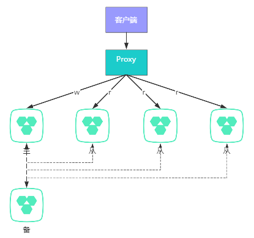

# MySQL文档

## 主从集群
参考资料1：https://blog.csdn.net/qq_40378034/article/details/91125768

### 主从复制原理


主从复制过程存在三个线程，master的I/O线程，slave的I/O线程与SQL线程。master需要开启binlog日志，slave需要开启relay日志。
具体复制流程如下：
1. slave的io_thread读取master的IP、端口、用户名、密码，以及binlog文件名和位置点，然后向master请求binlog；
2. master的io_thread根据slave请求的信息来读取binlog返回给slave；
3. slave的io_thread会把获取到的binlog写到本地relaylog（中继日志）文件中；
4. slave的sql_thread会定期读取relaylog，把二进制的日志解析成SQL语句并执行。

备注：随着于多线程复制方案的引入，sql_thread演化成了多个线程，出现单线程复制、并行复制之分。

### 主从架构


带proxy的主从读写分离架构。

## 主从复制实战
### 修改配置
分别修改master、slave的配置文件my.cnf。[点击这里](https://www.cnblogs.com/qianniao12/p/8011222.html)了解更多参数配置信。

* master配置
```properties
[mysqld]
server-id=1                         # 每个server服务的标识,必须唯一
log_bin=mysql-bin                   # 开启binlog记录功能并设置binlog文件名称
binlog_format=mixed                 # binlog格式，建议使用mixed。可选项statement|row|mixed
expire_logs_days=7                  # binlog过期删除时间。默认为0，表示不自动删除
binlog_cache_size=1m                # binlog缓冲大小，默认32K。使用show global status like '%binlog_cache%'判断大小是否合理
sync_binlog=1                       # 每写缓冲多次就同步到磁盘，默认为0。
innodb_support_xa=1                 # 此参数与XA事务有关，它保证了binlog与innodb redo log之间的同步，保证复制环境中数据一致性。建议必须设置
innodb_flush_log_at_trx_commit=1    # 在事务提交时处理redo日志的方式；此变量有三个可选值0，1，2
slave_skip_errors=1062              # 跳过1062错误（主键重复的错误）
binlog-ignore-db=mysql,information_schema,performance_schema # 忽略同步的库
```

* slave配置
```properties
[mysqld]
server-id=2                         # 每个server服务的标识,必须唯一
log_bin=mysql-bin                   # 开启binlog记录功能并设置binlog文件名称
relay-log=relay-bin                 # relay日志（中继日志）文件的路径名称
binlog_format=mixed                 # binlog格式，默认为statement，建议使用mixed。可选项statement|row|mixed
expire_logs_days=7                  # binlog过期删除时间。默认为0，表示不自动删除
binlog_cache_size=1m                # binlog缓冲大小，默认32K。使用show global status like '%binlog_cache%'判断大小是否合理
sync_binlog=1                       # 每写缓冲多次就同步到磁盘，默认为0。
slave_skip_errors=1062              # 跳过1062错误（主键重复的错误）
binlog-ignore-db=mysql,information_schema,performance_schema # 忽略同步的库
log_slave_updates=1                 # 是否把从master接受到的log并在本slave执行的内容记录到slave的二进制日志中，在级联复制环境中（包括双master环境），这个参数是必须的
read_only=1                         # 开启只读模式
```
部分重要配置参数详解：
* binlog_format 参考：https://www.cnblogs.com/xingyunfashi/p/8431780.html
* sync_binlog 参考：https://blog.csdn.net/edyf123/article/details/81030731
* innodb_flush_log_at_trx_commit 参考：https://www.cnblogs.com/klvchen/p/10861850.html 

### master操作
* 登录master
```
docker exec -it mysql-master bash
mysql -u root -p
```
* 创建同步数据的用户
```
CREATE USER 'slave'@'%' IDENTIFIED BY 'slavepwd';
GRANT REPLICATION SLAVE, REPLICATION CLIENT ON *.* TO 'slave'@'%';
```
* 检查主库的状态
```
show master status;
```


记录主数据库binary-log的文件名称和数据同步起始位置。
File : replicas-mysql-bin.000003 | Position : 617

### salve操作
* 登录salve
```
docker exec -it mysql-slave bash
mysql -u root -p
```
* 配置主库信息
```
CHANGE MASTER TO 
MASTER_HOST='192.168.171.129',
MASTER_PORT=3306,
MASTER_USER='slave',
MASTER_PASSWORD='slavepwd',
MASTER_LOG_FILE='mysql-bin.000003',
MASTER_LOG_POS=617;
```
* 重启slave服务
```
stop salve;
start salve;
```
* 查看slave状态
```
show slave status\G
```